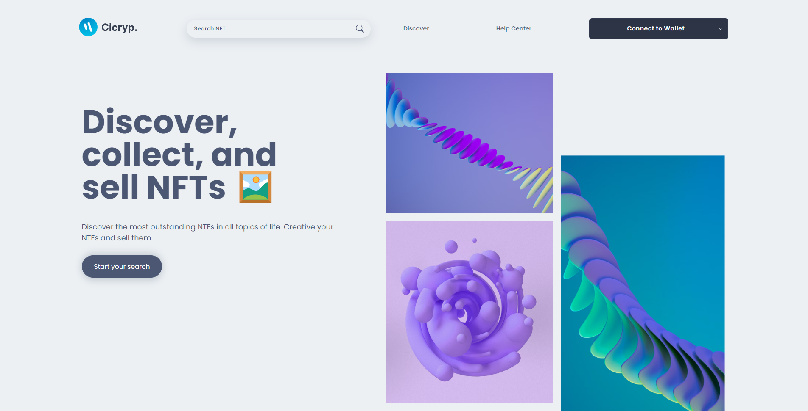

# Ciscryp - NFT Marketplace

- Live Demo: https://ciscryp-marketplace.vercel.app/

  

### Built with

- [ThirdWeb](https://thirdweb.com/)
- [HardHat](https://hardhat.org/)
- [Openzeppelin](https://www.openzeppelin.com/contracts)
- Binance Smart Chain (Testnet)
- [ViteJS](https://vitejs.dev/)
- Reactjs, Context API, CSS Modules

### Features:

- Create/Upload New Token to Marketplace.
- Buy and Sell NFTs on Marketplace through wallet apps NFT like Metamask, CoinbaseWallet, ...
- Searching NFTs by NFT name.

### Run on Localhost

1. **Clone this repo**

   ```
   git clone https://github.com/tfengaka/NFT_MarketPlace.git
   ```

2. **Deploy Contracts:**

   ```shell
     cd smartcontracts
     yarn install
     yarn deploy
   ```

3. **Run React App**

   Firstly, you need to create a evirontment file `.env` include your marketplace contract address `VITE_MARKETPLACE_ADDRESS`

   ```
      VITE_MARKETPLACE_ADDRESS="0x............."
   ```

   Finally, Run scripts to start web app:

   ```shell
     cd frontend
     yarn install
     yarn dev
   ```
